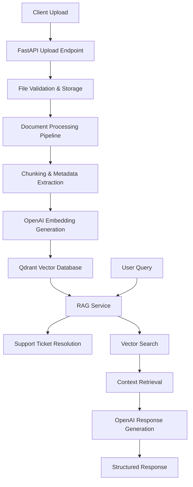

# 🧠 Support Agent RAG System

A **Knowledge Assistant** that helps support teams respond to customer tickets efficiently using a **Retrieval-Augmented Generation (RAG)** pipeline powered by **OpenAI’s LLM** and following **Model Context Protocol (MCP)** standards.

---

## 🚀 Overview

This system analyzes customer support queries and returns structured, relevant, and helpful responses. It combines document retrieval with language model generation to provide support agents with:

- **AI-generated responses** based on company documentation  
- **Relevant policy references** for accurate information  
- **Recommended actions** for proper ticket routing  

The RAG system automatically detects policy document changes and updates the knowledge base without manual intervention.

---

## 🏗️ System Architecture



**Core Components:**
- **Upload API** (`src/api/endpoint.py`) – File management endpoints  
- **Document Processor** (`scripts/load_documents.py`) – Text processing and chunking  
- **Vector Store** (`src/services/vector_store.py`) – Qdrant integration  
- **Embedding Service** (`src/services/embedding_service.py`) – OpenAI embeddings  
- **RAG Service** (`src/services/rag_service.py`) – Query processing pipeline  
- **Ticket Resolver** (`src/api/endpoints.py`) – Support ticket endpoints  

---
## Technical Decisions

### Why GPT-3.5-turbo?
- **Cost-effective** for high-volume support tickets
- **Fast responses** suitable for customer service
- **Excellent instruction following** for structured tasks

### Why Qdrant?
- **High-performance** vector similarity search
- **Scalable** for production workloads  
- **Easy deployment** with Docker

### Why RAG over Fine-tuning?
- **Dynamic knowledge** updates without retraining
- **Transparent citations** for support agent confidence
- **Cost-effective** for evolving documentation
 
---
## 🔧 Installation & Setup

```bash
# Clone the repository
git clone https://github.com/arshita1625/support-agent.git
cd support-agent

# Copy environment variables from .env file

# Start all services (Qdrant + App)
docker compose up --build

# View logs
docker compose logs -f

# Stop all services
docker compose down
```

The application will be available at:  
- **Main API:** http://localhost:8000  
- **Swagger Docs:** http://localhost:8000/docs  

---

## 📋 API Endpoints

### 📤 File Upload API

**Upload Document**  
```bash
curl -X POST
  "http://localhost:8000/api/upload/"
  -H "accept: application/json" 
  -H "Content-Type: multipart/form-data"
  -F "file=sample.md"
  -F "process_immediately=true"
```

### 📁 File Management API

**List All Files**  
```bash
curl -X GET "http://localhost:8000/api/upload/files" -H "accept: application/json"
```

**Delete File**  
```bash
curl -X DELETE "http://localhost:8000/api/upload/files/{filename}"      -H "accept: application/json"
```

### 🎯 Support Ticket Resolution API

**Resolve Support Ticket**  
```bash
curl -X POST "http://localhost:8000/resolve-ticket"      -H "Content-Type: application/json"      -d '{
       "ticket_text": "My domain was suspended yesterday and I need to reactivate it urgently. What steps should I take?"
     }'
```

### 🔍 System Health API

**Check Health**  
```bash
curl -X GET "http://localhost:8000/health"
```

---

## Running Tests

### 1. Activate Python environment
```bash
python3 -m venv .venv
source venv/bin/activate 
```

### 2. Install dependencies
```bash
pip install -r requirements.txt
```

### 3. Run test suite
```bash
pytest
```

---

## 👤 Author

**Arshita**  
*AI Engineer Candidate*  
📧 aarshita@uwaterloo.ca  
🔗 [LinkedIn](https://www.linkedin.com/in/arshita01625/) | [Portfolio](https://portfolio-i242.onrender.com/)  
